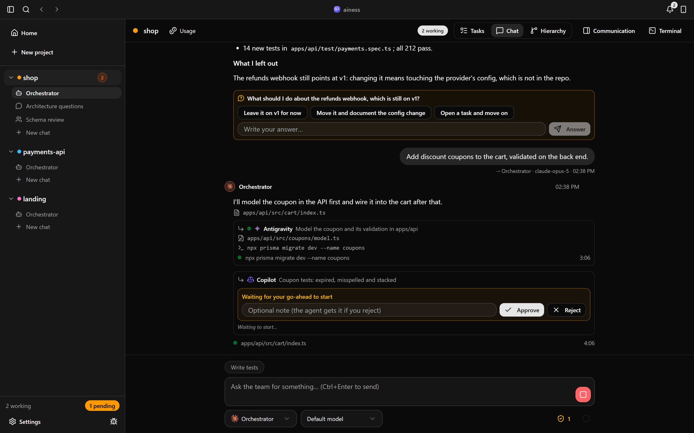
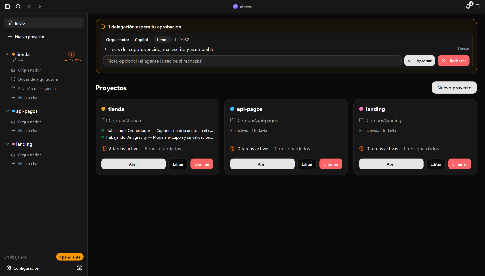
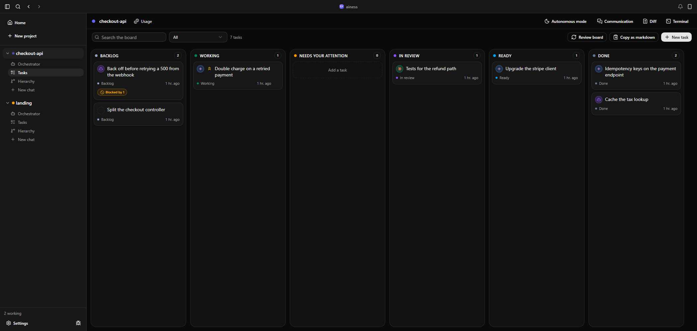
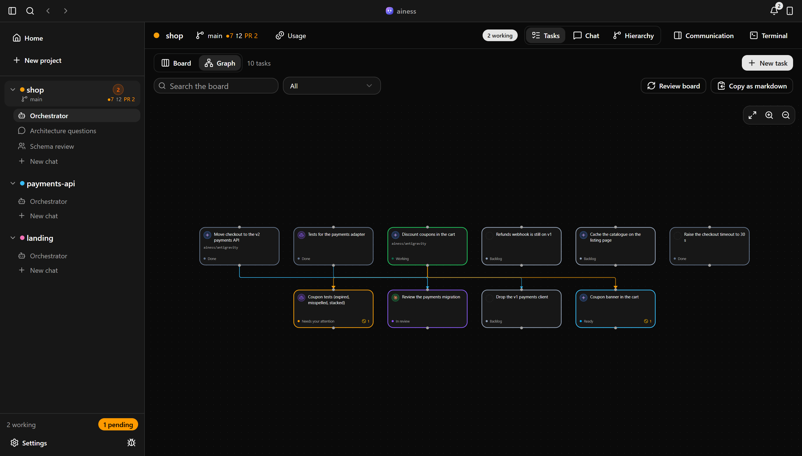
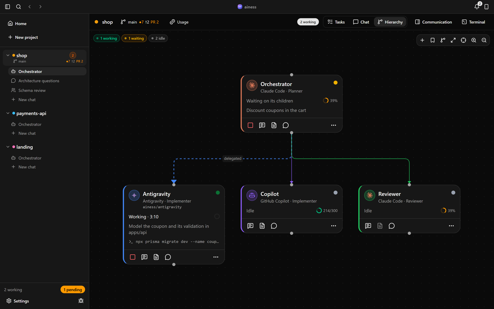
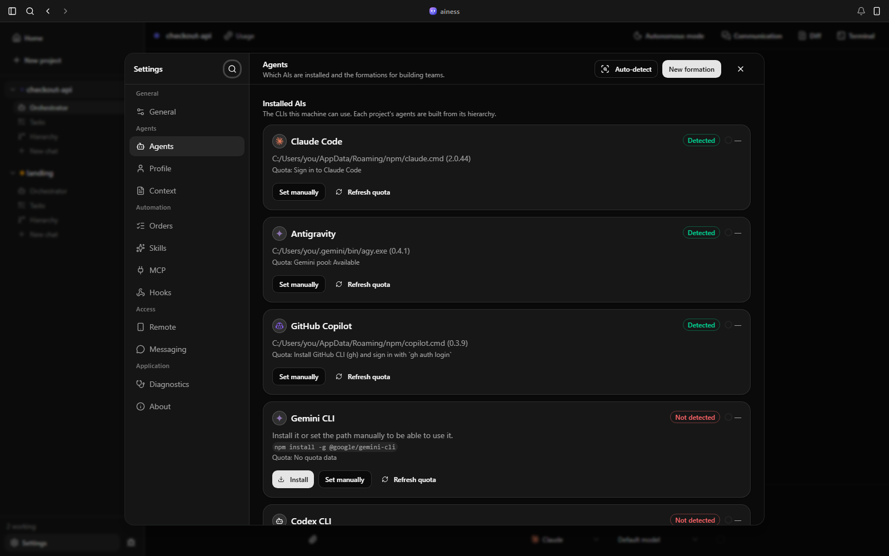
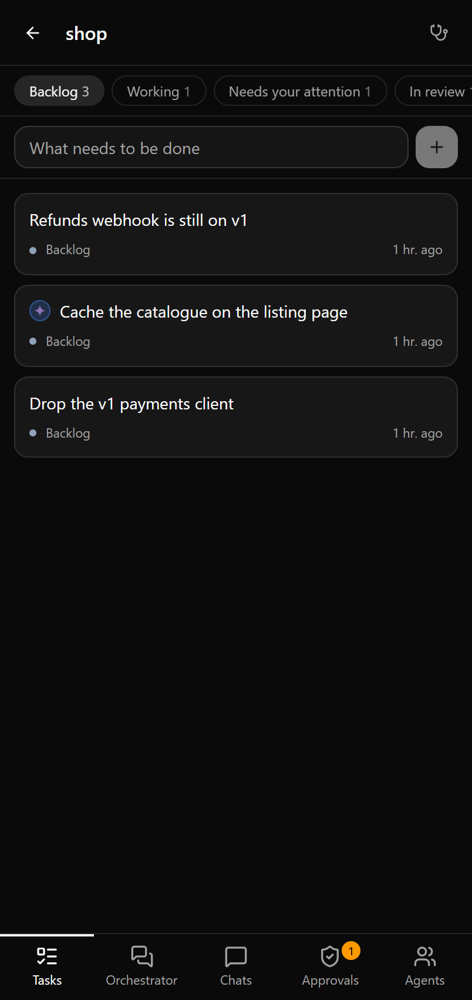
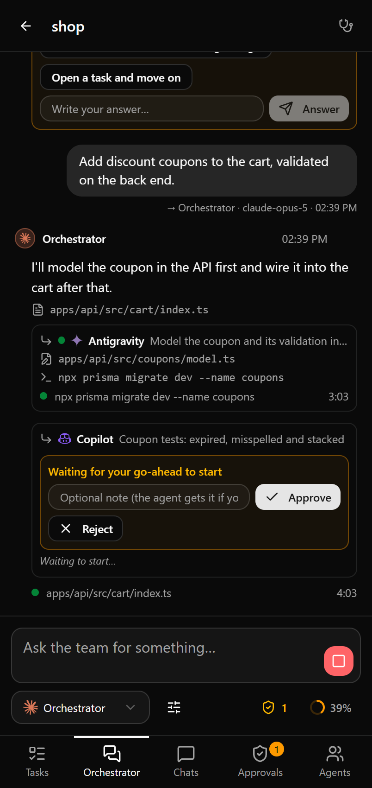
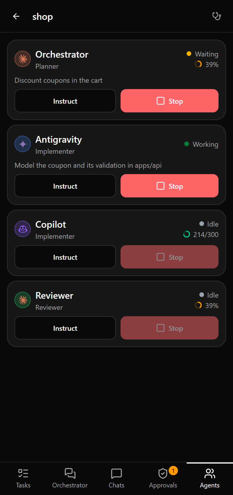

<div align="center">


# ainess

*You ask one agent. The team splits the work.*

[](https://github.com/Matias-Obezzi/ainess/releases/latest) [](https://github.com/Matias-Obezzi/ainess/releases) [](LICENSE) [](https://github.com/Matias-Obezzi/ainess/releases/latest) [](https://tauri.app)

**8 CLIs as one team · 7 languages · your phone included · nothing leaves your machine**

A desktop app that runs the AI coding CLIs already installed on your machine — Claude Code,
Antigravity, GitHub Copilot CLI, Gemini, Codex, opencode, Ollama, Aider — as a team. You give the
task to one agent; it plans, splits the work and delegates to the rest, and you watch the whole
thing happen in one place. It brings no model and no key of its own: it drives what you already
have, with the sessions you already opened.

[Download](https://github.com/Matias-Obezzi/ainess/releases/latest) · [Changelog](CHANGELOG.md) · [Report a bug](https://github.com/Matias-Obezzi/ainess/issues/new/choose)



</div>

> The interface speaks seven languages and follows your system unless you pick one; the
> screenshots here are in English. The code, this document and the commits are in English too.
> Windows is the platform it is developed and tested on.
>
> `PLAN.md` is the source of truth for the architecture, the type contracts and the protocol
> between the app and each CLI. When it and this document disagree, `PLAN.md` wins.

## Contents

- [Getting started](#getting-started) · [How it works](#how-it-works) · [Inside the app](#inside-the-app)
- [From your phone](#from-your-phone) · [Shared resources](#shared-resources) · [Hooks](#hooks) · [CLI](#cli)
- [Languages](#languages) · [Where your data lives](#where-your-data-lives) · [Releases](#releases) · [Layout](#layout)

## Getting started

### Install it

Grab the installer from [the latest release](https://github.com/Matias-Obezzi/ainess/releases/latest)
(`ainess_<version>_x64-setup.exe`) and run it. From then on the app updates itself: it checks on
startup and offers the new version from Settings → About.

Then bring your own CLIs. ainess runs what you already have — it never ships or bundles a provider —
and the app detects what is installed, says what is missing and can install most of them for you
from Settings → Agents:

| Provider | How it gets there |
| --- | --- |
| Claude Code | `npm install -g @anthropic-ai/claude-code` |
| GitHub Copilot CLI | `npm install -g @github/copilot` |
| Antigravity | `irm https://antigravity.google/cli/install.ps1 \| iex` |
| Gemini CLI | `npm install -g @google/gemini-cli` |
| Codex CLI | `npm install -g @openai/codex` |
| opencode | `npm install -g opencode-ai` |
| Ollama | `winget install Ollama.Ollama` |
| Aider | its own installer |
| Anything else | a **custom** agent runs any command, with `{prompt}` replaced in its arguments |

Sessions and API keys stay where each CLI keeps them. ainess never asks for a key, never stores one
and never reads one: if `claude` works in your terminal, it works here.

Detection is deliberately stubborn on Windows: it looks at the process PATH, at the *registry* PATH
(which is what installers update), at the winget package folders, at `WindowsApps` aliases and at
the usual `Program Files` locations. A CLI installed after the app started is still found.

### Or build it

Needs **Node.js 18+**, **Rust** with Cargo and **WebView2** (already present on current Windows).

```bash
npm install
npm run tauri dev      # the app, with hot reload
npm run tauri build    # NSIS installer in src-tauri/target/release/bundle
```

Other useful scripts:

```bash
npm run build          # web bundle + the phone page
npm run build:remote   # only the phone page (dist-remote/index.html)
npm run build:cli      # the CLI bundle, which embeds the phone page
npm test               # unit tests (vitest)
npx tsc --noEmit       # typecheck
cd src-tauri && cargo check && cargo test
```

## How it works

Agents are **one-shot CLI processes**. Every invocation is a *run*, and the conversation survives
across runs because each provider is resumed by its own session id (`--resume` for Claude Code,
`--conversation` for Antigravity, `--resume` for Copilot). The planner never loses context between
your prompts.

Agents form a **hierarchy** with a role each:

- **Planner** — reasons, splits the work and delegates. It can read the repo, search the web, run
  `git` and write inside `.claude/`, but it does not implement.
- **Implementer** — does the work in the workspace.
- **Reviewer** — checks what the implementers did.

A planner delegates by emitting a fenced block in its answer:

````
```delegate
{"tasks":[{"agent":"Implementer","task":"Add tests for the auth module and fix what fails"}]}
```
````

Each task has to stand on its own: the child never sees the planner's conversation. When the app is
set to let the orchestrator pick models, each task can carry a `"model"` too.

The orchestrator parses it, starts a run for that agent, and feeds the child's final answer back
into the planner's session as a result. That cycle is a **round**; the maximum per task is
configurable.

An agent can also stop and **ask you** instead of guessing, with an `ask` block:

````
```ask
{"question":"Move the refunds webhook to v2, or leave it on v1?","options":["Move it","Leave it"],"allowOther":true}
```
````

The conversation shows the options, you pick one (or write your own) and the run carries on in the
same session — from the app or from your phone.

## Inside the app

**Projects.** Each project points at a workspace folder and keeps its own team of agents, their
state, history and chats. A new project starts from a **formation**: a team you saved once and
apply to the next project, with its skills and MCP servers.



**Tasks.** Opening a project lands on its board: six columns from backlog to done, drag and drop,
right-click actions and an archive at the bottom.



The board is not a list you keep by hand. A prompt to the orchestrator opens a task; every
delegation hangs off it; one waiting for your approval sits in *needs you* until you approve it; and
when a run ends the card moves to review if the project has a reviewer, or straight to ready. A run
that fails goes back to *needs you* with the error in its detail.

The same tasks also draw a **dependency graph**, laid out in layers, where dragging from one card to
another declares that this one waits for that one (cycles are refused).



**The thread.** The Chat tab is a conversation with the orchestrator: its text as it arrives, the
tools it uses, the tasks it delegates (collapsible, rendered as markdown) and its final answer. A
delegation waiting for a yes is answered right there, under the delegation itself. Saved **orders** —
prompts you reuse — sit as chips above the input.

**Hierarchy.** The project's team as a graph: who delegates to whom, who is working right now, what
each agent is doing and how much quota it has left. It is also where the team is managed: add an
agent, duplicate one (two Claudes with different roles is a normal setup), remove one, or save the
whole team as a formation.



**Worktrees.** An agent can work in its own git worktree instead of sharing the folder with
everyone else: its own branch (`ainess/<agent>`), a sibling folder, and dependencies installed there
the first time. That is what lets two agents implement at once without fighting over the git index.
The Worktrees panel lists them and offers to open the folder, merge the branch back, or drop it —
the merge refuses to run when either side has uncommitted work, and a conflict is reported rather
than guessed at.

**Communication and terminals.** A right dock with the raw event feed and real terminals (PTY, tabs,
your shells). Closing the panel does not kill anything: a terminal only dies from its tab's close
button, from `exit`, or with the app.

**Approvals.** You can require your go-ahead before an agent receives a delegated task, per agent or
globally. Pending ones show up in the app, on your phone and in the CLI, and survive a restart.

**Chats.** Besides task delegation you can talk to one agent directly, or set up a shared
conversation where several answer in turn, each with a role for that chat.

**Quota.** The app reads what each provider has left — Claude Code from its credentials, Copilot from
the GitHub API, opencode per linked account, Antigravity inferred from its own "quota reached"
errors — and shows it as a ring next to each agent and under the input.



**Notifications.** A bell in the window bar keeps the history of what happened and what needs you:
approvals waiting, tasks finished or failed, runs cut short by a restart, a tunnel that fell, a new
version. Each row takes you to where it happened.

**Repo state.** For a project that is a git repo, the sidebar shows the branch, uncommitted changes
and how far ahead or behind the remote it is, and the header opens the open pull requests with their
CI and review state. It follows the folder through filesystem events, not a timer. It reads; it
never writes.

**Right click.** Contextual menus everywhere they mean something: projects, chats, agent nodes,
messages, terminal tabs, approvals. Where there is nothing to do, nothing opens.

**Tray.** The app can keep running in the background when you close the window and notify you when
an agent needs permission or finishes a task.

## From your phone

With your phone on the same WiFi you get the same app in one column: the board, the conversation,
the team and what it is spending. You can send a task, stop a run, approve a delegation and answer
a question — the things that keep the team moving while you are away from the desk.

| The board | The conversation | The team |
| --- | --- | --- |
|  |  |  |

Turn it on from the window bar button or Settings → Remote, then scan the QR. From the
terminal, `ais serve` does the same with the CLI's orchestrator. The page is the same React app,
built to a single self-contained `dist-remote/index.html` that both servers embed and send
compressed.

The URL carries a token; without it the server answers 401, and the page shows a form to type it
into (which is what an app installed to the home screen needs, since it opens without the query
string). It listens on the local network only, over plain HTTP. If the phone cannot reach it, allow
the port through the Windows firewall.

**HTTP API**, if you want to drive it from something else — `Authorization: Bearer <token>` or
`?token=`:

| Endpoint | What it does |
| --- | --- |
| `GET /api/state` | Full snapshot |
| `GET /api/events` | SSE stream of `state` events |
| `POST /api/prompt` | `{projectId, agentId?, text, model?}` |
| `POST /api/instruct` | `{projectId, agentId, text, model?}` |
| `POST /api/stop` | `{projectId, agentId?}` or `{chatId}` |
| `POST /api/approve` | `{approvalId, decision: "approve" \| "reject", note?}` |
| `POST /api/chat` | `{chatId, text}` |

### From outside your network

On top of the LAN server the app can publish a public URL through
[cloudflared](https://developers.cloudflare.com/cloudflare-one/connections/connect-networks/downloads/)
or [ngrok](https://ngrok.com/). The tunnel only forwards `127.0.0.1:<port>`, so the local server has
to be on first.

- **cloudflared, no account** — `winget install Cloudflare.cloudflared`. A new URL every time.
- **ngrok** — `winget install ngrok -s msstore`, or the button in Settings → Remote, which runs
  it for you. Needs an authtoken; the app can save it (in ngrok's own config file, never in
  ainess's) and tells you whether it is there.
- **A URL that never changes** — pick *Static* as the domain type. With ngrok that is the static
  domain the free plan includes (paste your API key and the app lists your domains to choose from).
  With cloudflared it is a named tunnel plus a hostname of your own:

  ```bash
  cloudflared tunnel login
  cloudflared tunnel create ainess
  cloudflared tunnel route dns ainess ainess.yourdomain.com
  ```

The ngrok agent is kept current on its own, because ngrok refuses connections from an agent older
than the minimum its account requires.

```bash
ais serve --tunnel                       # the provider saved in the config
ais serve --tunnel ngrok --tunnel-domain something.ngrok-free.app
ais remote url --tunnel                  # public URL of this process's tunnel
```

Anyone with the public URL and the token can operate the app. If it leaked, regenerate the token.

## Shared resources

- **Skills** — reusable instructions injected into the system prompt, for all agents or some.
- **MCP servers** — extra tools. Claude gets them per session with `--mcp-config`; Antigravity is
  synced machine-wide with `ais mcp sync`.
- **Shared context** — a block of text every agent receives about the project or the team.
- **Profile** — who you are and how you like to work, also injected into the system prompt.

## Hooks

Automatic reactions to orchestrator events, configured in Settings → Hooks or from the CLI.
The app fires them itself: nothing is delegated to the agent.

Events: `task.started`, `task.finished`, `task.failed`, `delegation`, `approval.requested`,
`run.finished`, `run.failed`, `agent.stopped`, `result`.

Actions: Slack or Discord webhook, generic webhook, local command, system notification, or an
instruction chained into another agent.

Template variables: `{{event}}`, `{{project}}`, `{{workspace}}`, `{{agent}}`, `{{agentRole}}`,
`{{runId}}`, `{{round}}`, `{{prompt}}`, `{{output}}`, `{{error}}`, `{{taskPrompt}}`, `{{time}}`, plus
`{{toAgent}}`, `{{task}}` and `{{model}}` on `delegation`. Truncate any of them with `{{output|300}}`.

```bash
ais hooks add SlackNotify --event task.finished --action slack \
  --url https://hooks.slack.com/services/T000... \
  --template "{{agent}} finished in {{project}}: {{output|300}}"

ais hooks add Review --event run.finished --filter-agent Implementer --action instruct \
  --agent Reviewer --template "Review these changes: {{output}}"
```

## CLI

The same orchestrator without the window. `npm run build:cli` produces it; run it with
`node bin/ais.js` or the `ais` binary.

```bash
ais "Add tests for the auth module" -w C:\repo    # run a task
ais -a Claude -p MyProject --max-rounds 4 "..."   # pick agent, project, rounds
ais projects add MyProject --dir C:\repo
ais agents list -p MyProject                      # the team of a project
ais agents add --name QA --provider antigravity --role reviewer --parent Claude -p MyProject
ais formations list                               # saved teams
ais formations apply "Full team" -p MyProject     # copy one into a project
ais detect                                        # what is installed, and where
ais doctor                                        # the same checks the app runs on itself
ais quota [provider] [--json]                     # what is left
ais usage                                         # what the runs cost
ais history -w C:\repo --limit 20                 # recent runs
ais history show 3f2a                             # one run in full
ais status                                        # saved state per project
ais approvals list | approve <id> | reject <id>
ais chat -a Antigravity -w C:\repo                # interactive chat
ais chat --shared "Claude:architect,Antigravity:critic" -w C:\repo
ais serve --port 4710                             # phone server
```

`ais run` exits with code 3 when a delegation is left waiting for approval.

## Languages

The interface speaks Spanish, English, Brazilian Portuguese, Simplified Chinese, Japanese, French and
German. Pick one in Settings → General, or leave it following the system. The change applies at
once, with no restart, and the phone page inherits whatever the app is using.

Translations live in `src/i18n/<lang>.ts`: flat dictionaries with dot-separated keys, Spanish as the
base. A missing key falls back to Spanish rather than showing the key, and a test keeps every
dictionary aligned with the base, key for key and placeholder for placeholder. The CLI is written
in Spanish; what it shares with the app — the quota lines, the dates — follows the configured
language.

## Where your data lives

| What | Where |
| --- | --- |
| Config | `%APPDATA%\com.ainess\config.json` |
| History per project | `%APPDATA%\com.ainess\history\<projectId>.json` |
| Chats | `%APPDATA%\com.ainess\chats\<id>.json` |
| Task board per project | `%APPDATA%\com.ainess\tasks\<projectId>.json` |
| Antigravity quota marks | `%APPDATA%\com.ainess\quota\antigravity.json` |
| Logs | `%LOCALAPPDATA%\com.ainess\logs\ainess-<date>.log` |

Everything is on your machine, in plain files you can read. Nothing is sent anywhere: the only
traffic ainess makes on its own is to GitHub for the update check and to each provider's own quota
endpoint.

History keeps the last 300 runs and 3000 messages per project, and the last 300 raw lines of each
run. A run cut short by closing the app comes back marked as interrupted, with a retry button.

Logs hold everything from `console.*`, uncaught frontend errors and backend events, one line each.
They rotate daily and are deleted after 14 days. Tokens are masked before anything is written.
Settings → General changes the level; Settings → About opens the folder and copies a
diagnostic.

Credentials are never stored by ainess. Provider tokens live where each CLI keeps them, and the
ngrok authtoken and API key stay in ngrok's own config file.

## Releases

Work happens on `dev`; `main` is what has been released. A release is a version number — Actions
does the rest.

1. **On `dev`.** Every push runs `ci.yml`: typecheck, unit tests, the web and CLI builds, the
   version check and `cargo check`.
2. **The pull request to `main`.** On top of those checks, `pr-installer.yml` builds the NSIS
   installer of that branch and attaches it to the run: an `.exe` to try before merging, kept for
   14 days. It carries no updater artifact and is never signed with the release key, so nothing
   built there can reach an installed app.
3. **The version.** Bump it in `package.json`, `src-tauri/tauri.conf.json` and
   `src-tauri/Cargo.toml` — the same number in the three; `npm run release:check` verifies they
   agree. Write what changed in `CHANGELOG.md`, which is what the app shows in Settings → About.
4. **Merge.** `release.yml` runs on `main`: it stops if the tag `v<version>` is already there
   (which is why a merge that does not change the version publishes nothing), and otherwise runs
   the typecheck, the unit tests, the CLI build and the Rust tests before `tauri-action` builds
   and signs the NSIS installer, tags, and publishes it with its `latest.json`.
5. **The update.** Installed apps pick it up on their next check — at startup if enabled, or from
   Settings → About — and update themselves.

The repo needs one secret, `TAURI_SIGNING_PRIVATE_KEY`, with the contents of the signing key. The
public half is already in `src-tauri/tauri.conf.json`.

## Layout

```
src/
  components/         UI (ui/ holds the shadcn-style primitives)
  lib/                orchestrator, providers, transports, quota, remote, tunnel, hooks…
  remote/             the phone app
  cli/                the CLI entry point
  i18n/               one dictionary per language
src-tauri/src/        runner, config, detect, remote server, tunnel, pty, tray, logging
docs/screenshots/     the images in this file
```

The frontend talks to the backend through a **transport**, and there are four: Tauri (the app), Node
(the CLI), HTTP (the phone) and a null one (the browser preview). Anything that touches the system
goes through it, which is why the same code runs in all four.

## License

[MIT](LICENSE). The providers it runs are not part of it: each CLI keeps its own licence and its own
terms of use.

## Reporting a bug

The bug icon in the sidebar opens the issue templates in your browser, or go straight to
[the issues page](https://github.com/Matias-Obezzi/ainess/issues/new/choose). When you paste logs,
check them for tokens first.
